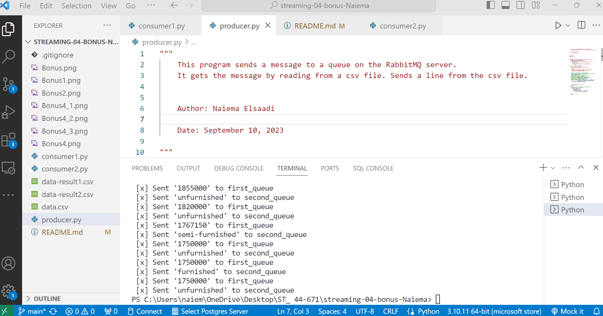

## streaming-04-bonus-Naiema
    
This project demonstrates a data processing pipeline using RabbitMQ with a producer and two consumers.

 Author: Naiema Elsaadi 
 Date: September 10, 2023 

## Introduction
The provided Python code is a solution designed to streamline the processing of data from a multi-column CSV file through the utilization of RabbitMQ queues. This project offers an efficient way to split and process data from an input CSV file and apply specific transformations to the extracted information. By distributing the workload to multiple worker processes, this code demonstrates the power of RabbitMQ in managing concurrent data processing tasks.

## Getting Started

  <B> Before You Begin </b> 

**To run this project, follow these steps:**

1. Clone the repository to your local machine.
2. Set up a RabbitMQ server (if not already done).
3. Modify the producer script (producer.py) to send data to RabbitMQ queues.
4. Run the producer script to populate the queues.
5. Run consumer1.py and consumer2.py to process the data and write results to CSV files.

## Project Structure

- `producer.py`: Sends data from `data.csv` to two RabbitMQ queues.
- `consumer1.py`: Monitors the first queue, performs transformations, and writes to `data-result1.csv`.
- `consumer2.py`: Monitors the second queue, performs transformations, and writes to `data-result2.csv`.
- `data.csv`: original csv file, input CSV file with multiple columns.
- `data-result1.csv`: Output CSV file for processed data from consumer 1.
- `data-result2.csv`: Output CSV file for processed data from consumer 2.
- `README.md`: Project documentation.

## Usage

1. Run the three python files in the bash:
in anaconda Prompt (miniconda3) run these: 
  1. **python producer.py**
  2. **python consumer1.py**
  3. **python consumer2.py**
  
  

   ## Reference

- [RabbitMQ Tutorial - Work Queues](https://www.rabbitmq.com/tutorials/tutorial-two-python.html)

## Source Data for csv file:
https://www.kaggle.com/datasets/yasserh/housing-prices-dataset

## The following modules are used in this project:
  csv	
  random	
  signal	
  sys	
  time	
  pika

## Prerequisites
 Git
 Python 3.10+ 
 VS studio Code 
 anaconda prompt (miniconda3)
 RabbitMQ

## Multiple Terminals Screenshots

## RabbitMQ WebInterface screenshot:

